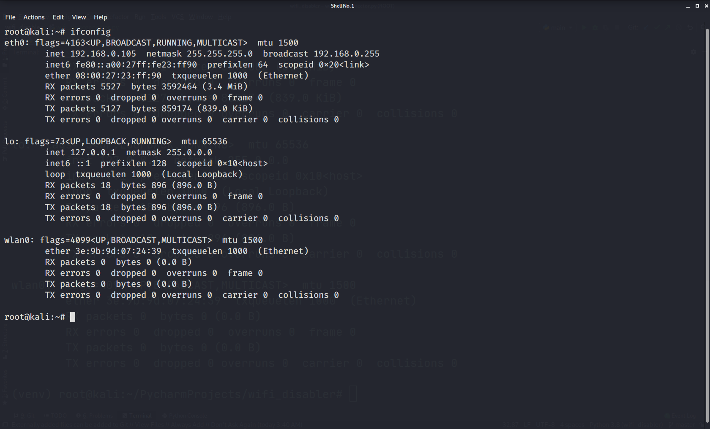
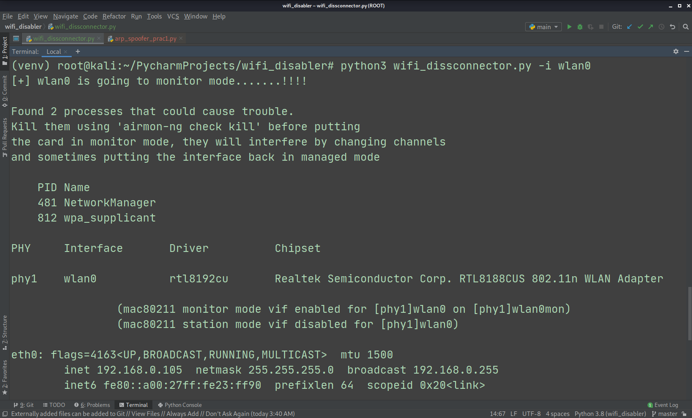
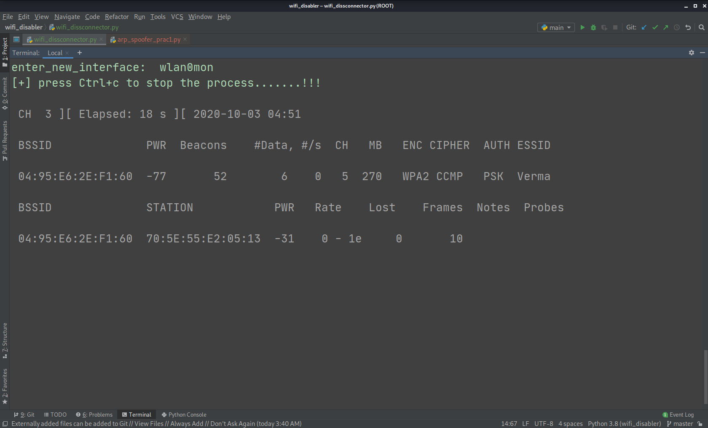
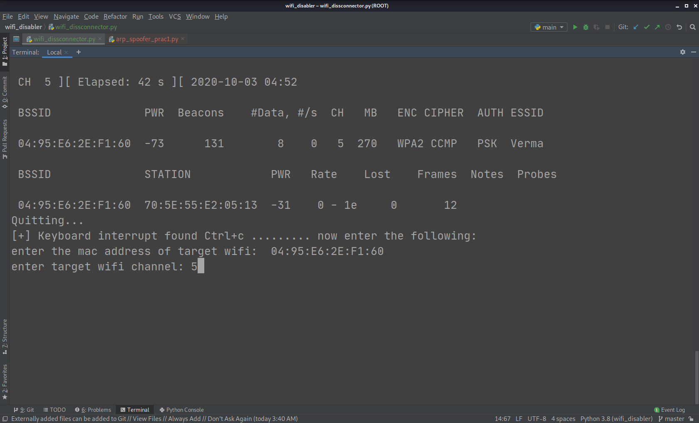
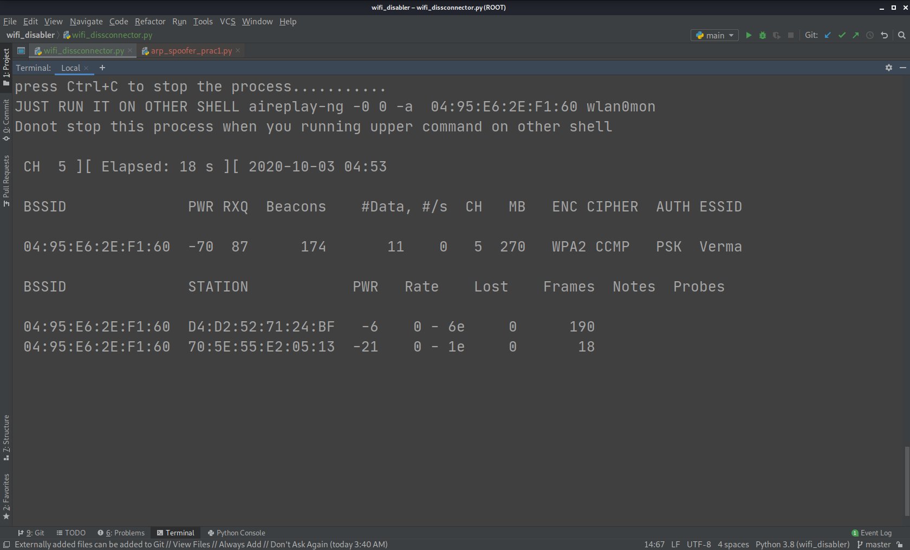
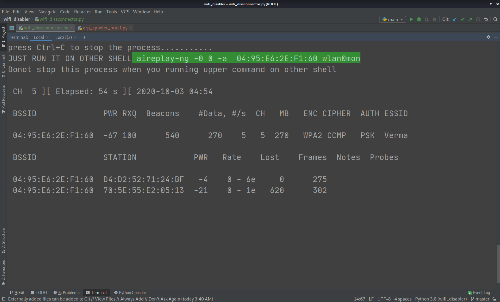
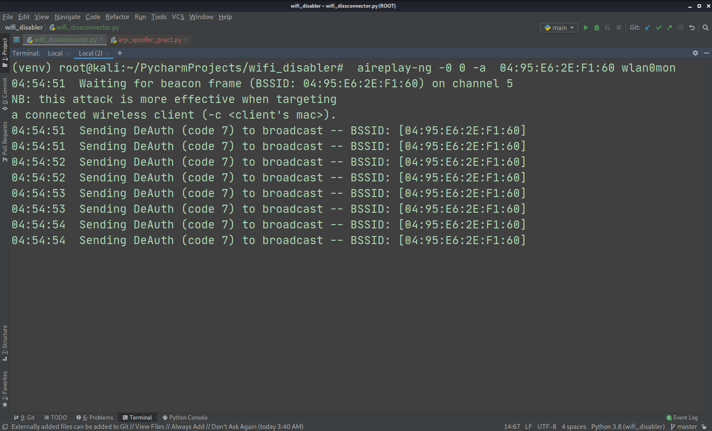

# Disable_Any_wifi_network_python_script
Disable or enable any wifi network which are discovered in the range of your device PC or router

# note that you must  be  using a wireless external adaptor beacause monitor mode will not work if you using virtual lab it may work if you are using live kali so remember using a external wifi adaptor

# Consists of subprocess,optparse and we can also use time module(for how much time you want to disable your or any other discovered wifi)

this is going to be interesting as we are mainly using tools which are already in kali such as 
# airmon - for enabling monitor mode 
# airodump - for dumping all nearby networks
# aireplay - for applying deauthentication packets or for disabling the wifi
you can follow the steps:
# ifconfig

# entering argument -i or --iface

# now our wireless module is going to monitor mode

# Monotor mode you can see ether part is encrypted now

# entering the modified interface or entering the same if it doesn't modified

# discovering networks wifi and devices connected to them

# entering the target details 

# now our adaptor is on target mac

# now running the aireplay command on new shell now the target network is disabled till it runs
# press ctrl+c to stop

